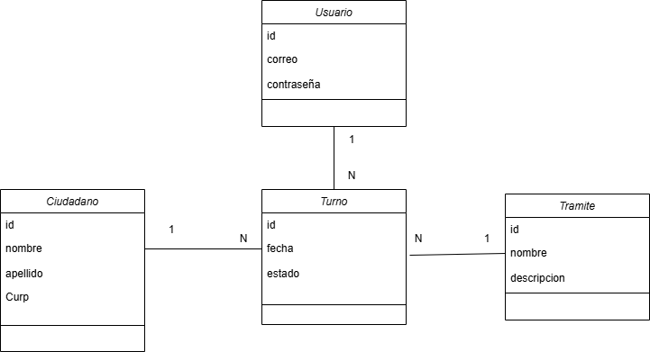
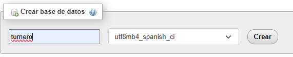

# Documentación Prueba técnica 2

## Aplicación de gestión de turnos/citas 📑

## Tabla de contenidos
- [Introducción](#Introducción)
- [Requisitos del proyecto ](#Requisitosdelproyecto )
- [Diagrama de clases](#Diagramadeclases )
- [Supuestos ❓](#Supuestos  )
- [Configuraciones ](#Configuraciones  )
- [Autor 👨‍💻](#Autor )

### Introducción

- Objetivo
    - reforzar conocimientos en java y java web mediante la elaboración de una aplicación de tipo CRUD en la cual se incluya JSP y JPA
- Descripción de la aplicación
    - se elaboro una aplicación de tipo administrativa en la cual se gestionan turnos de tramites de diferentes ciudadanos y estos guardados en una base de datos los turnos también tienen estado es decir si esta en espera o ya se atendió
        - agrega turnos
        - lista turnos
        - filtra turnos
        

### Requisitos del proyecto  ✅

- Java + Servlets
- JSP (frontend)
- JPA (Base de datos)
- Colecciones y objetos
- Lambdas

### Diagrama de clases

### Especificaciones del sistema  💻

- especificaciones
    - Java 17
    - XAMPP
    - Netbeans 17
    - Apache tomcat   →  version ( [9.0.98](https://tomcat.apache.org/download-90.cgi#9.0.98) )

### Supuestos ❓

la parte de las id no las pido , igual en los constructores no incluyo id 

### Configuraciones  **⚙️**

- Usuarios y contraseñas
    - Apache tomcat
        - usuario : admin
        - contraseña: 123
    - Mysql
        - usuario: root
        - contraseña: “ ” (esta en blanco ni tiene contraseña)
    - Base de datos
        - nombre de la base de datos :  turnero
    - Sistema tunero
        - correo:
        - contraseña:
- Ejecución del sistema
    - Descargar el sistema y contar con las especificaciones anteriormente mencionadas
    - Crear una base de datos con el nombre: turnero y con este formato
    
    
    
    - hacer la conexión de la base de datos
    - se recmienda hacer un clean and build para evitar posibles errores

### Autor 👨‍💻

***José Luis Ruiz Chavez***   

*JVB01SM*
